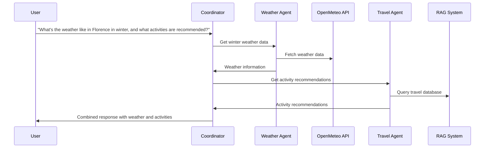

# Weather Agent Integration Design

## Challenge Overview
The stakeholders want to explore how function calling and extensions can provide real-time data to our travel assistant, specifically focusing on weather information. They also want to evaluate single-agent versus multi-agent architectures.

## Multi-Agent Architecture
```
L200-upskilling/
├── app/
│   ├── backend/
│   │   ├── agents/           # New directory for specialized agents
│   │   │   ├── __init__.py
│   │   │   ├── weather_agent.py
│   │   │   ├── travel_agent.py    # Existing RAG-based agent
│   │   │   └── coordinator_agent.py  # Orchestrates between agents
│   │   ├── models/
│   │   ├── rag/
│   │   └── tools/
│   │       ├── weather/
│   │       └── geocoding/
│   └── evaluation/
```

## Agent Roles & Responsibilities

### Travel Agent (Existing)
- Handles static travel information via RAG
- Manages user preferences and history
- Provides general travel recommendations

### Weather Agent (New)
- Real-time weather data fetching
- Weather pattern analysis
- Location-specific weather insights
- Seasonal weather recommendations

### Coordinator Agent (New)
- Orchestrates between agents
- Decides which agent to route queries to
- Combines responses for cohesive answers

## Implementation Steps
1. Build weather API integration using OpenMeteo
2. Implement geocoding with Google Maps Places API
3. Create controlled generation with Gemini
4. Develop testing and evaluation framework
5. Integrate with existing RAG system
6. Add rich UI elements for weather display

## Interaction Flow Diagram


## Benefits
1. **Separation of Concerns**: Each agent specializes in its domain
2. **Scalability**: Easy to add new specialized agents
3. **Performance**: RAG and real-time data optimized separately
4. **Maintenance**: Easier to update individual components
5. **Testing**: Independent agent evaluation

## Evaluation Strategy
- Individual agent performance metrics
- Inter-agent communication efficiency
- Overall system response quality
- Real-time data accuracy
- Response latency measurements

## Next Steps
1. Set up weather agent with OpenMeteo integration
2. Implement geocoding functionality
3. Create test cases and evaluation framework
4. Integrate with existing RAG system
5. Document performance metrics and findings 